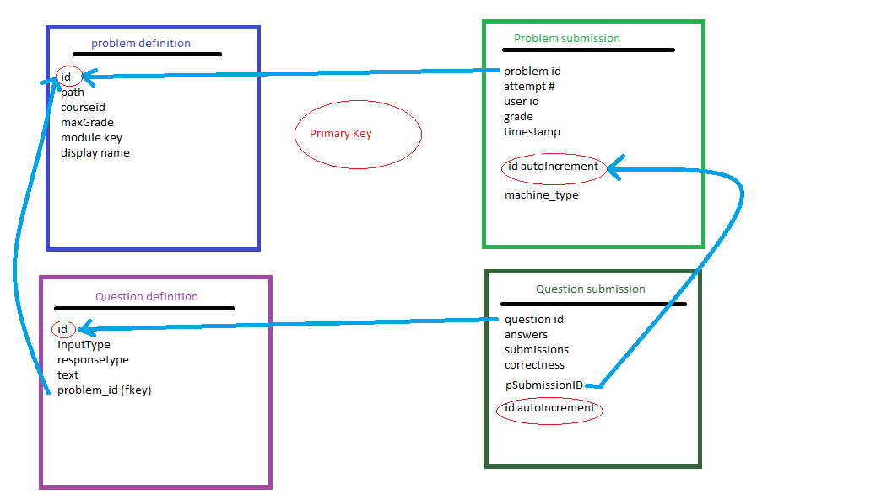

Migration to MySql
==================================
Documentation for moving the McGillx reserach data to a relational database.
We used MySql (since it's free) but the mechanism for any other db should be similar. Note that older versions of MySql do not have the datetime(6) type. If you're using an older version, you can use datetime instead, but you will lose the full timestamp (it will truncate to the nearest second). 

All code for migrating JSON to mysql is in C# and will be made available on our github at a later date.

Constructing the db
-------------------------------
Here is a list of the tables present in our database in alphabetical order.

- all_logs
- auth_user
- auth_userprofile
- certificates_generatedcertificates
- courses
- courseware_studentmodule
- forum_searched
- forum_text_created
- forum_text_voted
- problem_definition
- problem_submission
- question_definition
- question_submission
- student_anonymoususerid
- student_courseenrollment
- student_languageproficiency
- teams
- teams_membership
- user_id_map
- video_events

Note that McGill offers several courses every year, and often re-offers the same course over the years. As such, we manually created  the courses table to hold the course ids for each course.
This has been very helpful in ensuring that each uploaded log has a valid course id with it (much of the data from edx is incomplete or otherwise garbled).
Our *courses* table has the following format:

=========   ================== 
Field           Type   
=========   ==================
id            vachar(255)
offering      tinyint(4)
code          varchar(20)
title         varchar(255)
term          varchar(200
startDate     date
endDate       date
=========   ==================

A sample entry might look like:

``course-v1:McGillX+ATOC185x+1T2016 | 3 | ATOC185x | Natural Disasters | 1T2016 | 2016-01-13 | 2016-04-08``

This entry describes the third offering of the course titled Natural Disasters. 

The id for this course is course-v1:McGillX+ATOC185x+1T2016.

The course code is ATOC185x, and it was offered in the winter term of 2016. It started on January 13, and ended on April 8. 

The course_id field in all other tables is a foreign key to the id field of the courses table.

Uploading sql files
-----------------------

Once you have downloaded and decrypted the datapackage with the sql files, you are ready to create the tables and upload the files to your database.
The precise syntax for table creation and file uploads will likely depend on which database management system you are using. 
If you are using MySql, you can upload each file by using the *load data local infile* command. An example is shown below for the auth_user table.

.. code:: mysql

  load data local infile 'pathTofile/auth_user.sql' into table auth_user 
  FIELDS TERMINATED BY '\\t' LINES TERMINATED BY '\\n'  
  IGNORE 1 LINES (id,username,first_name,last_name,email,
  password,is_staff,is_active,is_superuser,last_login,date_joined,
  status,email_key,avatar_typ,country,show_country,date_of_birth,
  interesting_tags,ignored_tags,email_tag_filter_strategy,
  display_tag_filter_strategy,consecutive_days_visit_count,course_id) 
  SET course_id='McGillX/CHEM181x_2/3T2014';

Since not all of the files provided by edx have a courses column, we added that ourselves. Be sure to add the extra column in the table when you create it. Then, when you upload the date, you can set the value for each course simultaneously using the SET command.

Uploading JSON files
--------------------------------
The section will detail how we parsed speficic event types in the JSON files from the tracking logs.

The basic steps for parsing the JSON files and uploading various event types are:

#. Define a class for each relvant Object in the JSON code. We didn't keep all fields in all event types, as they weren't all of interest. If you want to keep different fields, you would have to modify the appropriate class description at the beginning of the C# file. Note that the JSON code contains nested objects, so be careful to modify the correct class. 
#. Once the class exists, it needs corresponding BuildObject method. There are several such methods in the code, and we need one per object. These methods take as input a single line of JSON text and extract and return the corresponding object. For example, BuildTrackingObjectVideoLoad returns a VideoLoad object. 
#. In the ReadFile() method there is a switch statement based on the value of the static class variable EVENT_TYPE. Presently supported values are Discussion, Video, and Problem. A value of Discussion will upload supported forum events, Video will deal with video events, and Problem will deal with problem events (the only one presently supported is problem_check) - see sub-sections below for specific details. 

General Notes:

- Logs that throw an exception will be written to file and the code will continue to run
- If the connection dies, the last known file and line numbers are written to file so that it can be started again in the correct place. 
- On our systems, the way in which the files from 2015 onwards are stored is different from the way in which the older ones are stored. This is why you can see the following condition blocks in the code ::

      foreach (int y in years)
      {
          year = y;
          Console.WriteLine("Year " + year);
          //2013, 2014 are stored differently. 
          if (year > 2014)
          {
              Post2014Logs(year, cnn);
          }
          else
          {
              Pre2015Logs(year, cnn);
          }
      }
  You likely will want to modify the paths in these methods to suit your own directory structures.

Video events
^^^^^^^^^^^^^^^^^^^^^^^
In video events, we dealt with the following event types:

- edx.video.closed_captions.hidden
- edx.video.closed_captions.shown 
- hide_transcript 
- load_video
- pause_video             
- play_video                
- seek_video             
- show_transcript         
- speed_change_video      
- stop_video            
- video_hide_cc_menu      
- video_show_cc_menu  

The parent classes for the various supported video events are: VideoSeek, VideoSpeed, VideoLoad, and VideoOther

The data from all video events are inserted into the video_event table. However, we need separate classes because not all events have the same fields. The VideoSeek class supposrts the seek_video event. The VideoSpeed class supports the speed_change_video event. The VideoLoad class supports the load_video event type. all other event types listed above are supported via the VideoOther class. 

Our *video_events* table has the following format:

===========================     ======================================================== 
Field                             Type   
===========================     ========================================================
id                                int(11) auto-increment
event_type                        varchar(45)
path                              text
user_id                           int(11)
code                              varchar(45)
currentTime                       float
module_id                         varchar(255)
new_time                          int(11)
old_time                          int(11)
new_speed                         enum('0.25','0.50','0.75','1.0','1.25','1.50','2.0')
old_speed                         enum('0.25','0.50','0.75','1.0','1.25','1.50','2.0')
time_event_emitted                datetime(6)
course_id                         varchar(255)
===========================     ========================================================

Note: if using a DBMS that does not have an enum or similar type, any floating point type should suffice. Enum was used because there is a small number of possible speeds to which a video can be set. 

The new_time and old_time fields are only not-null for the seek_video event_type. The new_speed and old_speed are only not null for the speed_change_video event type. currentTime is null for seek_video and load_video. 

Forum events
^^^^^^^^^^^^^^^^^^^^^^^
In discussion forum events, we dealt with the following event types:

- edx.forum.response.created
- edx.forum.comment.created
- edx.forum.thread.created 
- edx.forum.response.voted
- edx.forum.thread.voted  
- edx.forum.searched

The forums events are stored in three tables: one for *.voted, one for *.created, and one for *.searched. The parent classes for each of those three object types are:

- DiscussionSearch - data to insert in forum_searched
- DiscussionVote - data to insert in forum_text_created
- DiscussionText - date to insert in forum_text_voted

Our *forum_searched* table has the following format:

===========================     ======================================================== 
Field                             Type   
===========================     ========================================================
id                                int(11) auto-increment
event_type                        varchar(255)
time_event_emitted                datetime(6)
query                             text
total_results                     int(11)
corrected_text                    text  
user_id                           int(11)
course_id                         varchar(255)
===========================     ========================================================

Our *forum_text_voted* table has the following format:

===========================     ======================================================== 
Field                             Type   
===========================     ========================================================
id                                int(11) auto-increment
event_type                        varchar(255)
category_id                       varchar(45)
category_name                     text
undo_vote                         tinyint(1)
time_event_emitted                datetime(6)
user_id                           int(11)
course_id                         varchar(255)
===========================     ========================================================

Our *forum_text_created* table has the following format:

===========================     =============================================================
Field                             Type   
===========================     =============================================================
id                                varchar(45)
event_type                        varchar(255)
anonymous                         tinyint(1)
anonymous_to_peers                tinyint(1)
body                              text
category_id                       varchar(45)
category_name                     text
followed                          tinyint(1)
thread_type                       varchar(45)
title                             varchar(45)
user_course_role                  set('Instructor','Staff','beta_testers') 
user_forum_role                   set('Student','Community TA','Moderator','Administrator')
response_id                       varchar(45)
discussion_id                     varchar(45)
time_event_emitted                datetime(6)
user_id                           int(11)
team_id                           varchar(45)
course_id                         varchar(255)
===========================     =============================================================

Problem events
^^^^^^^^^^^^^^^^^^^^^^^
In problem events, we have only dealt with the following event type:

- problem_check

Below is a detailed sketch of the four tables involved in storing the problem_check details. 
Note that we define a *problem* as a non-empty set of questions which has a single 'submit' or 'check' button.
Every question belongs to a problem. A problem might have many questions.

The main class for problem_check events is ProblemCheck. The BuildTrackingObjectProblem method is more involved than all of the other BuildObject methods as many of the fields in the problem_check event are simple list or dictionary types. These have to be parsed in a more involved manner than simply serializing the JSON string. 

Due to how the foreign keys are set up in the database, it is important to first insert problem definitions, then problem submissions and question definitions (in either order) and question submissions last. 
