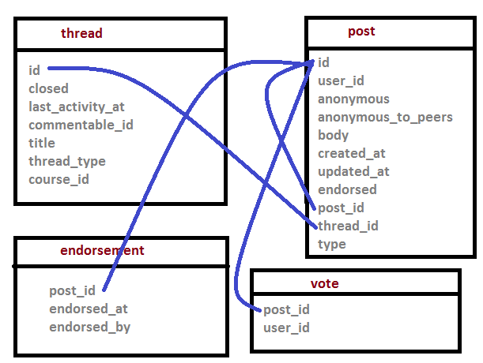

Migration to MySql
==================================
Documentation for moving the McGillx reserach data to a relational database.
We used MySql (since it's free) but the mechanism for any other db should be similar. Note that older versions of MySql do not have the datetime(6) type. If you're using an older version, you can use datetime instead, but you will lose the full timestamp (it will truncate to the nearest second). 

All code for migrating JSON to mysql is in C# and will be made available on our github at a later date.

We will also upload (on github) some possibly useful mysql queries used for data generation. 

Constructing the db
-------------------------------
Here is a list of the tables present in our database in alphabetical order.

- all_logs
- auth_user
- auth_userprofile
- certificates_generatedcertificates
- course_module
- courses
- courseware_studentmodule
- discussion_endorsement                   
- discussion_post                    
- discussion_thread
- discussion_vote 
- discussion_view
- django_comment_client_role_users
- forum_searched
- forum_text_created
- forum_text_voted
- poll_submissions
- problem_definition
- problem_submission
- question_definition
- question_submission
- student_anonymoususerid
- student_courseaccessrole
- student_courseenrollment
- student_languageproficiency
- teams
- teams_membership
- user_id_map
- video_events

Note that McGill offers several courses every year, and often re-offers the same course over the years. As such, we manually created  the courses table to hold the course ids for each course.
This has been very helpful in ensuring that each uploaded log has a valid course id with it (much of the data from edx is incomplete or otherwise garbled).
Our *courses* table has the following format:

=========   ================== 
Field           Type   
=========   ==================
id            vachar(255)
offering      tinyint(4)
code          varchar(20)
title         varchar(255)
term          varchar(200
startDate     date
endDate       date
=========   ==================

A sample entry might look like:

``course-v1:McGillX+ATOC185x+1T2016 | 3 | ATOC185x | Natural Disasters | 1T2016 | 2016-01-13 | 2016-04-08``

This entry describes the third offering of the course titled Natural Disasters. 

The id for this course is course-v1:McGillX+ATOC185x+1T2016.

The course code is ATOC185x, and it was offered in the winter term of 2016. It started on January 13, and ended on April 8. 

The course_id field in all other tables is a foreign key to the id field of the courses table.

Uploading sql files
-----------------------

Once you have downloaded and decrypted the datapackage with the sql files, you are ready to create the tables and upload the files to your database.
The precise syntax for table creation and file uploads will likely depend on which database management system you are using. 
If you are using MySql, you can upload each file by using the *load data local infile* command. An example is shown below for the auth_user table.

.. code:: mysql

  load data local infile 'pathTofile/auth_user.sql' into table auth_user 
  FIELDS TERMINATED BY '\\t' LINES TERMINATED BY '\\n'  
  IGNORE 1 LINES (id,username,first_name,last_name,email,
  password,is_staff,is_active,is_superuser,last_login,date_joined,
  status,email_key,avatar_typ,country,show_country,date_of_birth,
  interesting_tags,ignored_tags,email_tag_filter_strategy,
  display_tag_filter_strategy,consecutive_days_visit_count,course_id) 
  SET course_id='McGillX/CHEM181x_2/3T2014';

Since not all of the files provided by edx have a courses column, we added that ourselves. Be sure to add the extra column in the table when you create it. Then, when you upload the date, you can set the value for each course simultaneously using the SET command. Note that although a user might be registered in multiple courses, they can only appear in this table once. As such, whatever course_id value that user gets assigned will be the *first* course in which they are enrolled (assuming the data is loaded in chronological order). Since we do not use the wiki tool in edx, the related tables are absent in our db (since they are empty). If you use that tool your database will have additional tables.

Update: At the end of October 2016, edx added two new tables: django_comment_client_role_users, and student_courseaccessrole. The first indicates all course user's roles on the discussion board, and the latter simply lists all staff, instructors, and beta testers for each course. This is *extremely* helpful, as now if you want to only include students in any query, you can simple add the following WHERE clause to all queries:

.. code:: mysql
  WHERE user_id NOT IN (SELECT user_id FROM student_courseaccessrole;

Uploading JSON files
--------------------------------
There are two types of JSON files included in the data dump: tracking logs, and files describing the course structure. 

Course Structure
------------------
The course structure files were uploaded into the course_module table. Each of these files contains a dictionary of all of the pieces in the coruse. They keys are the id of the course module being describe, and the value is a tuple: (category, children, metadata). The category is one of the values on the tree shown below (note that there are more possible categories at the leaf level than those listed). A chapter corresponds to a *section* in studio. A sequential is a *subsection*, a vertical is a *unit*, and the leaves are *components*. The children are lists of child id's. The course will have a list of chapter ids, each chapter will have a list of sequential ids, etc. The contents of the metadata varies highly depending on the category. We have included in our table only the metadata that we deem relevant. You might want to store more or less information depending on your needs. 

Our *course_module* table has the following format:

===========================     ======================================================== 
Field                             Type   
===========================     ========================================================
id                                varchar(255)
category                          varchar(255)
display_name                          varchar(255)
start_date                          datetime(6)
end_date                          datetime(6)
due_date                          datetime(6)
format                            varchar(255)
graded                            tinyint(1)
parent_course_module_id           varchar(255)
===========================     ========================================================

Tracking Logs
------------------
The section will detail how we parsed speficic event types in the JSON files from the tracking logs.

The basic steps for parsing the JSON files and uploading various event types are:

#. Define a class for each relvant Object in the JSON code. We didn't keep all fields in all event types, as they weren't all of interest. If you want to keep different fields, you would have to modify the appropriate class description at the beginning of the C# file. Note that the JSON code contains nested objects, so be careful to modify the correct class. 
#. Once the class exists, it needs corresponding BuildObject method. There are several such methods in the code, and we need one per object. These methods take as input a single line of JSON text and extract and return the corresponding object. For example, BuildTrackingObjectVideoLoad returns a VideoLoad object. 
#. In the ReadFile() method there is a switch statement based on the value of the static class variable EVENT_TYPE. Presently supported values are Discussion, Video, and Problem. A value of Discussion will upload supported forum events, Video will deal with video events, and Problem will deal with problem events (the only one presently supported is problem_check) - see sub-sections below for specific details. 

General Notes:

- Logs that throw an exception will be written to file and the code will continue to run
- If the connection dies, the last known file and line numbers are written to file so that it can be started again in the correct place. 
- On our systems, the way in which the files from 2015 onwards are stored is different from the way in which the older ones are stored. This is why you can see the following condition blocks in the code ::

      foreach (int y in years)
      {
          year = y;
          Console.WriteLine("Year " + year);
          //2013, 2014 are stored differently. 
          if (year > 2014)
          {
              Post2014Logs(year, cnn);
          }
          else
          {
              Pre2015Logs(year, cnn);
          }
      }
  You likely will want to modify the paths in these methods to suit your own directory structures.
- For most tables, inserts are done after every relevant line in the tracking logs. In order to speed up performance, it would be reasonable to collect a larger number of values and then do a batch insert.

Video events
^^^^^^^^^^^^^^^^^^^^^^^
In video events, we dealt with the following event types:

- edx.video.closed_captions.hidden
- edx.video.closed_captions.shown 
- hide_transcript 
- load_video
- pause_video             
- play_video                
- seek_video             
- show_transcript         
- speed_change_video      
- stop_video            
- video_hide_cc_menu      
- video_show_cc_menu  

The parent classes for the various supported video events are: VideoSeek, VideoSpeed, VideoLoad, and VideoOther

The data from all video events are inserted into the video_event table. However, we need separate classes because not all events have the same fields. The VideoSeek class supposrts the seek_video event. The VideoSpeed class supports the speed_change_video event. The VideoLoad class supports the load_video event type. all other event types listed above are supported via the VideoOther class. 

Our *video_events* table has the following format:

===========================     ======================================================== 
Field                             Type   
===========================     ========================================================
id                                int(11) auto-increment
event_type                        varchar(45)
path                              text
user_id                           int(11)
code                              varchar(45)
currentTime                       float
module_id                         varchar(255)
new_time                          int(11)
old_time                          int(11)
new_speed                         enum('0.25','0.50','0.75','1.0','1.25','1.50','2.0')
old_speed                         enum('0.25','0.50','0.75','1.0','1.25','1.50','2.0')
time_event_emitted                datetime(6)
course_id                         varchar(255)
===========================     ========================================================

Note: if using a DBMS that does not have an enum or similar type, any floating point type should suffice. Enum was used because there is a small number of possible speeds to which a video can be set. 

The new_time and old_time fields are only not-null for the seek_video event_type. The new_speed and old_speed are only not null for the speed_change_video event type. currentTime is null for seek_video and load_video. 

Forum events
^^^^^^^^^^^^^^^^^^^^^^^
In discussion forum events, we dealt with the following event types:

- edx.forum.response.created
- edx.forum.comment.created
- edx.forum.thread.created 
- edx.forum.response.voted
- edx.forum.thread.voted  
- edx.forum.searched

The forums events are stored in three tables: one for *.voted, one for *.created, and one for *.searched. The parent classes for each of those three object types are:

- DiscussionSearch - data to insert in forum_searched
- DiscussionVote - data to insert in forum_text_created
- DiscussionText - date to insert in forum_text_voted

Our *forum_searched* table has the following format:

===========================     ======================================================== 
Field                             Type   
===========================     ========================================================
id                                int(11) auto-increment
event_type                        varchar(255)
time_event_emitted                datetime(6)
query                             text
total_results                     int(11)
corrected_text                    text  
user_id                           int(11)
course_id                         varchar(255)
===========================     ========================================================

Our *forum_text_voted* table has the following format:

===========================     ======================================================== 
Field                             Type   
===========================     ========================================================
id                                int(11) auto-increment
event_type                        varchar(255)
category_id                       varchar(45)
category_name                     text
undo_vote                         tinyint(1)
time_event_emitted                datetime(6)
user_id                           int(11)
course_id                         varchar(255)
===========================     ========================================================

Our *forum_text_created* table has the following format:

===========================     =============================================================
Field                             Type   
===========================     =============================================================
id                                varchar(45)
event_type                        varchar(255)
anonymous                         tinyint(1)
anonymous_to_peers                tinyint(1)
body                              text
category_id                       varchar(45)
category_name                     text
followed                          tinyint(1)
thread_type                       varchar(45)
title                             varchar(45)
user_course_role                  set('Instructor','Staff','beta_testers') 
user_forum_role                   set('Student','Community TA','Moderator','Administrator')
response_id                       varchar(45)
discussion_id                     varchar(45)
time_event_emitted                datetime(6)
user_id                           int(11)
team_id                           varchar(45)
course_id                         varchar(255)
===========================     =============================================================

Problem events
^^^^^^^^^^^^^^^^^^^^^^^
In problem events, we have only dealt with the following event type:

- problem_check

Below is a detailed sketch of the four tables involved in storing the problem_check details. 
Note that we define a *problem* as a non-empty set of questions which has a single 'submit' or 'check' button.
Every question belongs to a problem. A problem might have many questions.

.. figure:: ../../../images/problem_check_sketch.png

Our *problem_definition* table has the following format:

===========================     =============================================================
Field                             Type   
===========================     =============================================================
id                                varchar(255)
path                              text
course_id                         varchar(255)
max_grade                         float
module_id                         varchar(255)
display_name                      text
===========================     =============================================================

Our *problem_submission* table has the following format:

===========================     =============================================================
Field                             Type   
===========================     =============================================================
id                                int(11) auto increment
problem_id                        varchar(25)
attempt_number                    smallint(6)
user_id                           int(11)
grade                             float
time_event_emitted                datetime(6)
machine_type                      varchar(45)
===========================     =============================================================

Notes: The machine_type field is used to distinguish between operating systems, as well as between mobile/tablet/pc users.

Our *question_definition* table has the following format:

===========================     =============================================================
Field                             Type   
===========================     =============================================================
id                                varchar(255)
input_type                        varchar(45)
response_type                     varchar(45)
question_text                     text
problem_id                        varchar(255)
===========================     =============================================================

Notes: input_type includes: choicegroup, textline, optioninput, etc. response_type includes multiplechoiceresponse, stringresponse, optionresponse etc. 

Our *question_submission* table has the following format:

===========================     =============================================================
Field                             Type   
===========================     =============================================================
id                                int(11) auto increment
quesiton_id                       varchar(255)
answers                           text
submissions                       text
correctionness                    enum('correct','incorrect','partially-correct')
problem_submisison_id             int(11)
===========================     =============================================================

Notes: answers will include things like 'choice_0', whereas submissions will contain the text value of choice_0 (eg, agree). 

The main class for problem_check events is ProblemCheck. The BuildTrackingObjectProblem method is more involved than all of the other BuildObject methods as many of the fields in the problem_check event are simple list or dictionary types. These have to be parsed in a more involved manner than simply serializing the JSON string. 

Due to how the foreign keys are set up in the database, it is important to first insert problem definitions, then problem submissions and question definitions (in either order) and question submissions last. 

The inserts for question and problem definitions are done a little differently. In order to avoid inserting the same definition every time a student completes a problem, we build hashmaps (keys are compared based on problem/quesiton ids) and then insert at the end - normal inserts are done after every line. 

Poll events
^^^^^^^^^^^^^^^^^^^^^^^

For poll event logs, we examined the event type *xblock.poll.submitted*. Polls are an advanced problem type with full support on the edx platform. The *poll_submissions* table has the following format:

===========================     =============================================================
Field                             Type   
===========================     =============================================================
id                                int(11) auto increment
user_id                           int(11)
course_id                         varchar(255)
choice                            text
display_name                      text
url_name                          varchar(255)
usage_key                         varchar(255)
time_event_emitted                datetime(6)
path                              varchar(255)
===========================     =============================================================

A sample entry might look like: 

``1 | 2862119 | course-v1:McGillX+GROOCx+T3_2015 | B      | Poll         | 5455f167adb241e583f3462976e77057``
``| block-v1:McGillX+GROOCx+T3_2015+type@poll+block@5455f167adb241e583f3462976e77057 | 2015-09-2111:14:57.376300``
``| /courses/course-v1:McGillX+GROOCx+T3_2015/xblock/block-v1:McGillX+GROOCx+T3_2015+type@poll+block@5455f167adb241e583f3462976e77057/handler/vote |``

Note that the usage_key field is a module_id as described in the courseware_studentmodule table. 

Implicit Events
^^^^^^^^^^^^^^^^^^^^^^^
You may have noticed that most of the entries in your tracking logs have an event type that looks more like a url than anything else. These are classified by edx as implicit events and, as far as we know, very little work has been done with them. However, you might also have noticed, that none of the explicit events describe what we will call `discussion views'. In addition to knowing when a learner makes a post, we would also ideally like to be able to know when they read a post. In order to track down this information, we had to dig into the implicit events. 

The first issue to tackle is that of deciding what it means for a student to `read' a discussion post. Since `comments', `replies', and `threads' are all displayed on the same webpage, the best we can do is check when a student looked at a `thread'. This, combined with a timestamp, is sufficient to deduce which `comments' and `replies' were also on the page at that time.

A more thorough investigation would require that a minimum amount of time is spent on the thread's page before it qualifies as being read. However, at this point, we will define a Discussion View event as whenever a student visits the webpage of a course thread, no matter how brief that visit. In order to isolte these events from the tracking logs, and insert them into a 'discussion_view' table, we used the following query:

.. code:: mysql

  INSERT INTO discussion_view (course_id, user_id, time_event_emitted, thread_id)
  SELECT course_id, user_id, time_event_emitted, RIGHT(event_type, 24) FROM all_logs
  WHERE event_type LIKE '%/discussion/forum/%/threads/%' AND NOT user_id IS NULL AND NOT page_url IS NULL;

If you look at the 'event_type' fields that contain the specified substring, you can see that the last 24 characters are discussion thread id's. 

Given that the above is the only informaion we could extract at this point, our *discussion_view* table has the following format:

===========================     =================================
Field                             Type   
===========================     =================================
id                                int(11) auto increment
course_id                         varchar(255)
user_id                           int(11)
time_event_emitted                datetime(6)
thread_id                         varchar(45)
===========================     =================================

Uploading Mongo Files
------------------------
Most of the information about the edx discussion posts is included in duplicate in the data packages: it is in the tracking logs, as well as in the .mongo files. See the edx documentation for details on the structure of the mongo files in your data download.

In the interst of completeness, we included both sources of data in the database. The discussion logs from the tracking logs are stored in the tables with the prefix 'forum\_'. The discussion logs from the mongo files are stored in tables with the prefix 'discussion\_'. Note that when posts get deleted in the forum, there are not inlucded in the .mongo file since they are removed from the database. However, they will still appear in the tracking logs. That being said, there are presently small glitches in the edx export methodology, so it is normal that a small amount of posts appear in the .mongo files but do not appear as explicit events in the tracking logs (if you want to dig, you can find them as implicit events). 

A sketch of the structure of the relationship between the tables for this dataset is shown below:

The above schema contains four tables. The *discussion_thread* table is used to describe a parent thread. Every thread id will have at least one log in the *discussion_post* table associated with it. There is a post that contains the body and other information for the original thread, and there may also be posts corresponding to responses and comments. Responses can be endorsed my moderators as either correct answers to questions or quality contributions to discussions. If the *endorsed* attribute is true, then the post should have a corresponding entry in the *discussion_endorsement* table. Finally, both threads and responses can be 'upvoted'. All upvotes are documented in the *discussion_vote* table. 

Details of these discussion table formats are below

Our *discussion_thread* table has the following format:

===========================     =============================================================
Field                             Type   
===========================     =============================================================
id                                varchar(255)
closed                            tinyint(1)
last_activity_at                  datetime(6)
commentatble_id                   varchar(255)
title                             text
thread_type                       enum('discussion','question')
course_id                         varchar(255)
===========================     =============================================================

Our *discussion_post* table has the following format:

===========================     =============================================================
Field                             Type   
===========================     =============================================================
id                                varchar(255)
user_id                           int(11)
anonymous                         tinyint(1)
anonymous_to_peers                tinyint(1)
body                              text
created_at                        datetime(6)
updated_at                        datetime(6)
endorsed                          tinyint(1)
post_id                           varchar(255) <- fkey to self.
thread_id                         varchar(255)
type                              enum('thread','response','comment') 
===========================     =============================================================

Our *discussion_endorsement* table has the following format:

===========================     =============================================================
Field                             Type   
===========================     =============================================================
post_id                           varchar(255)
endorsed_at                       datetime(6)
endorsed_by                       int(11)
===========================     =============================================================

Our *discussion_vote* table has the following format:

===========================     =============================================================
Field                             Type   
===========================     =============================================================
post_id                           varchar(255)
user_id                           int(11)
===========================     =============================================================
