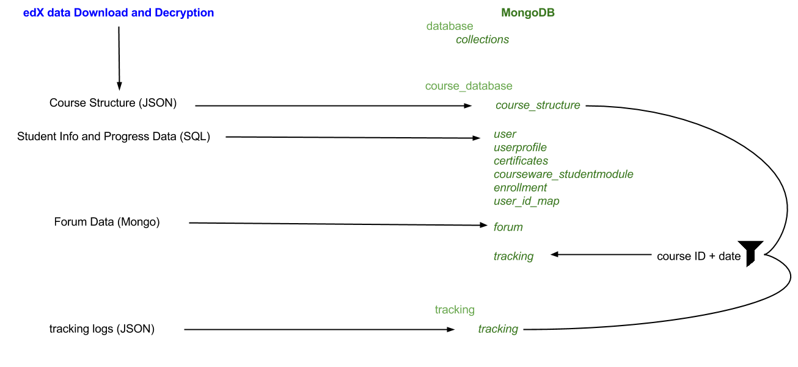

Getting Started
===============

If you are hosting courses on edx.org, before starting the setup consult with edX to setup keys and credentials for data transfer.

The McGillX Research Platform (moocx) is underdevelopment. At present only report generation (data exports) can be run from the moocx command line interface; all setup and import is still perform using individual scripts. Following the workflow below will walk you through downloading and decrypting data from edX, uploading it to a mongo database and installing the moocx python package for creating csv extracts for analysis.

Workflow Overview
-----------------

.. toctree::
   :numbered:
   
   edx_data_download_and_decryption
   populating_mongo_databases
   moocx
   extract_csv_datasets

